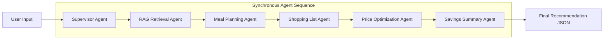

# Agentic Workflow - GrocerMind AI

This document details the agentic workflow running under the hood of GrocerMind AI. Rather than using slow, distributed microservices, our 12-hour hackathon MVP treats agents as **logical stages inside a synchronous pipeline**. This guarantees sub-second response times and zero message-queue overhead, which is perfect for live hackathon judging.

---

## Agent Pipeline Overview

The pipeline is triggered when the user submits their parameters (family size, budget, dietary preferences, pantry items, and location). Execution is coordinated by the **Supervisor Agent**, which moves the context sequentially through five specialized agent stages:

---

## Agent Details & Specifications

### 1. Supervisor Agent
- **Role**: Pipeline orchestrator and input normalizer.
- **Input**: Raw HTTP request body (budget, family size, pantry items, location).
- **Execution Logic**:
  - Validates and sanitizes parameters (e.g., converts budget to a number, normalizes pantry item strings).
  - Sequentially passes the data to the downstream service layers.
- **Output**: Orchestrates final unified response containing the logs of the executed workflow.

### 2. RAG Retrieval Agent
- **Role**: Context retrieval and ingredient filtering.
- **Input**: Sanitized user budget, location, and list of pantry items.
- **Execution Logic**:
  - Accesses the mock vector database (`chroma_ready.json`).
  - Filters out items that are already in the user's pantry to avoid buying duplicates.
  - Dynamically calculates a `maxIngredientPrice` (budget ceiling per ingredient, capped at 25% of the total weekly budget or a minimum of 250 LKR) to filter out prohibitively expensive items.
  - Sorts remaining "in-stock" items from lowest to highest price.
- **Output**: A context block containing available, affordable, in-stock ingredients.

### 3. Meal Planning Agent
- **Role**: AI-driven (simulated/deterministic for MVP) recipe builder.
- **Input**: User dietary preferences, family size, and the affordable ingredients retrieved by the RAG agent.
- **Execution Logic**:
  - Groups affordable ingredients by categories (Staples/Flour, Vegetables, Proteins).
  - If no affordable ingredients are found, it falls back to a warning response.
  - Selects the cheapest staple and vegetables to formulate a basic 2-day Sri Lankan meal plan (e.g., dhal and carrot curry with flatbread).
- **Output**: A structured meal plan object containing days and meal descriptions.

### 4. Shopping List Agent
- **Role**: Grocery list extractor.
- **Input**: The proposed meal plan and details of selected ingredients.
- **Execution Logic**:
  - Maps the recipes back to the required raw ingredients.
  - Dictates standard pack sizes and quantities based on the family size.
- **Output**: A structured list of items containing names and quantities (e.g., `[{ "name": "Potatoes", "quantity": "500 g" }]`).

### 5. Price Optimization Agent
- **Role**: Supermarket price comparison and vendor matcher.
- **Input**: The generated shopping list.
- **Execution Logic**:
  - Looks up the name of each ingredient in the mock database across all vendors (Keells, Cargills).
  - Resolves exact matches or performs a string search.
  - Identifies the cheapest vendor for each specific item.
- **Output**: A vendor comparison table mapping each item to its price at Cargills, Keells, recommended cheapest store, and recommended price.

### 6. Savings Summary Agent
- **Role**: Financial calculator.
- **Input**: The vendor comparison table from the Price Optimization Agent.
- **Execution Logic**:
  - Totals the cost of the recommended items (cheapest options).
  - Establishes a baseline cost by compiling the price of those exact items if bought entirely at Keells (acting as the default benchmark).
  - Computes savings as: `Savings = Baseline Cost - Total Optimized Cost`.
- **Output**: Total estimated cost and estimated savings in LKR.
