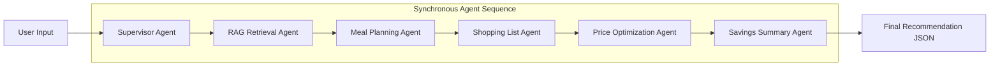

# Agentic Workflow - GrocerMind AI

This document details the agentic workflow running under the hood of GrocerMind AI. Rather than using distributed microservices or live scraping, the MVP treats agents as **logical stages inside a synchronous pipeline** executing within a single HTTP request cycle. This guarantees sub-second response times and zero message-queue overhead.

---

## Agent Pipeline Overview

The pipeline is triggered when a client invokes `POST /api/plan`. Execution is coordinated by the **Supervisor Agent**, which passes the request context sequentially through five downstream agent services:

---

## Detailed Agent Specifications

### 1. Supervisor Agent
*   **Location**: [api/plan.js](file:///c:/Users/ASUS/Desktop/AGENTRIX26-TEAM35-Bug_Busters/backend/plan.js)
*   **Role**: Pipeline orchestrator and response aggregator.
*   **Input**: Raw HTTP request body (`req.body`).
*   **Execution Logic**:
    1.  Receives request body and triggers the pipeline.
    2.  Invokes RAG Retrieval Agent to get price context.
    3.  Passes price context and user input to Meal Planning Agent to get meal plan & shopping list.
    4.  Passes the shopping list to Price Optimization Agent to generate store comparison table.
    5.  Passes comparison table to Savings Summary Agent to compute total and savings.
    6.  Assembles and returns a unified JSON payload with status `200`.
*   **Output**: Unified response containing `workflow`, `priceContext`, `mealPlan`, `shoppingList`, `vendorTable`, `totalEstimatedCost`, `estimatedSavings`, and `notes`.
*   **Dependencies**: `priceService.js`, `aiService.js`, `costService.js`.
*   **Assumptions**: `req.body` is successfully parsed as JSON by `body-parser`.

---

### 2. RAG Retrieval Agent
*   **Location**: [priceService.js](file:///c:/Users/ASUS/Desktop/AGENTRIX26-TEAM35-Bug_Busters/backend/services/priceService.js) (`getPriceContext`)
*   **Role**: Context retrieval, pantry exclusion, and budget filtering.
*   **Input**: User request parameters (destructures `budget` and `pantryItems`; defaults `pantryItems` to `[]`).
*   **Execution Logic**:
    1.  Normalizes item names by converting to lowercase and stripping non-alphanumeric characters.
    2.  Filters local database (`ragItems` loaded from `chroma_ready.json`) to exclude items already present in `pantryItems` (case-insensitive, normalized comparison).
    3.  Filters out out-of-stock items (`availability.toLowerCase() !== "in stock"`).
    4.  Extracts the best (cheapest) store and price for each unique ingredient.
    5.  Computes an ingredient budget cap: `maxIngredientPrice = budget * 0.25` (capped at a minimum of `250 LKR`). If `budget` is invalid or missing, the ceiling defaults to `Number.POSITIVE_INFINITY`.
    6.  Filters unique items to only include those where `bestPrice <= maxIngredientPrice`.
    7.  Sorts affordable items in ascending order of price.
*   **Output**: A price context object containing:
    *   `source`: `"dummy-grocery-price-dataset"`
    *   `itemCount`: total items loaded from database (108).
    *   `affordableItems`: sorted list of unique ingredients under the budget cap.
    *   `allItems`: all unique items in the database sorted by price.
*   **Dependencies**: `chroma_ready.json` (root database fallback), `keells.json`, `cargills.json`.
*   **Assumptions**: The dummy database is bundled locally. If `keells.json` and `cargills.json` contain no items (currently `{"items": []}`), the system falls back to parsing `chroma_ready.json`.

---

### 3. Meal Planning Agent
*   **Location**: [aiService.js](file:///c:/Users/ASUS/Desktop/AGENTRIX26-TEAM35-Bug_Busters/backend/services/aiService.js) (`generateMealPlan`)
*   **Role**: Recipe formulator utilizing affordable ingredients.
*   **Input**: User inputs (ignored) and the `priceContext` retrieved by RAG.
*   **Execution Logic**:
    1.  Extracts `affordableItems` from price context.
    2.  Groups items into categories: `Vegetable`, proteins (`Meat` and `Fish / Seafood`), and staples (`Flour` and `Grocery`).
    3.  Creates a fallback pool from the first 6 affordable items.
    4.  If the fallback pool is empty, returns empty arrays with a warning note.
    5.  Selects 4 items to formulate a 2-day meal plan:
        *   `staple`: first available staple (or fallback)
        *   `vegetable`: first available vegetable (or fallback)
        *   `secondVegetable`: second available vegetable (or fallback)
        *   `protein`: first available protein (or fallback)
    6.  Proposes a two-meal plan structure:
        *   **Monday**: `${vegetable.name} curry with ${staple.name}`
        *   **Tuesday**: `${protein.name} with ${secondVegetable.name}`
*   **Output**: `mealPlan` (days and meal descriptions) and `shoppingList` ingredients.
*   **Dependencies**: None.
*   **Assumptions**: The dummy database contains items categorized as `Vegetable`, `Meat`, `Fish / Seafood`, `Flour`, or `Grocery`. If categorization fails, the selection falls back to the top items in the sorted affordable list.

---

### 4. Shopping List Agent
*   **Location**: [aiService.js](file:///c:/Users/ASUS/Desktop/AGENTRIX26-TEAM35-Bug_Busters/backend/services/aiService.js) (integrated inside `generateMealPlan`)
*   **Role**: Extractor of raw ingredients and quantities for the meal plan.
*   **Input**: Selected ingredients (staple, vegetable, secondVegetable, protein).
*   **Execution Logic**:
    1.  Maps each of the 4 selected ingredients to a shopping list item.
    2.  Sets the required item name and pack size (`size` from database record, e.g. `"500 g"` or `"1 kg"`).
*   **Output**: A list of objects containing `{ name, quantity }`.
*   **Dependencies**: None.
*   **Assumptions**: Quantities correspond directly to the database packaging size (e.g. `size` field). Family size does not dynamically scale the quantity in the current implementation.

---

### 5. Price Optimization Agent
*   **Location**: [priceService.js](file:///c:/Users/ASUS/Desktop/AGENTRIX26-TEAM35-Bug_Busters/backend/services/priceService.js) (`comparePrices`)
*   **Role**: Multi-vendor supermarket price comparator.
*   **Input**: The compiled shopping list.
*   **Execution Logic**:
    1.  For each shopping list item, query all pricing records matching the ingredient name.
    2.  Performs exact name match (normalized) first, then falls back to substring inclusion matching if no exact match is found.
    3.  Aggregates prices by store name (Cargills, Keells).
    4.  Identifies the `recommendedStore` (cheapest store) and `recommendedPrice` (cheapest price).
    5.  Sets `matched: true` (or `false` if the item is not in the database).
*   **Output**: `vendorTable` comparison rows for each item.
*   **Dependencies**: None.
*   **Assumptions**: Substring-based fallback matching is sufficient to resolve price comparison in the absence of exact name alignment.

---

### 6. Savings Summary Agent
*   **Location**: [costService.js](file:///c:/Users/ASUS/Desktop/AGENTRIX26-TEAM35-Bug_Busters/backend/services/costService.js) (`calculate`)
*   **Role**: Budget totals and savings estimator.
*   **Input**: The comparison `vendorTable` from the Price Optimization Agent.
*   **Execution Logic**:
    1.  Sums up the `recommendedPrice` of all items to compute `total` optimized checkout cost.
    2.  Establishes a baseline cost (`keellsTotal`) by summing `prices.Keells` for all items. If an item does not have a Keells price, it falls back to the `recommendedPrice`.
    3.  Calculates savings as: `savings = keellsTotal - total`.
*   **Output**: `{ total, savings }` in LKR.
*   **Dependencies**: None.
*   **Assumptions**: Keells is the default baseline retailer. If Keells doesn't sell a specific item, the savings baseline defaults to the recommended price, resulting in `0` LKR savings for that particular item.
