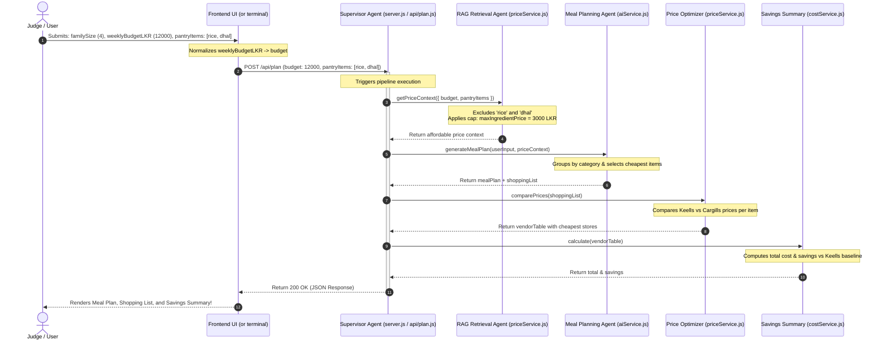

# Demo Flow - GrocerMind AI

This guide walks you through setting up and running the live demo for GrocerMind AI. It shows how the system responds to different user budgets, pantry contents, and dietary parameters to prove the MVP agentic pipeline functions correctly.

---

## 1. Setup & Installation

Before running the demo, ensure you have [Node.js](https://nodejs.org/) installed, then follow these steps in your terminal:

```bash
# 1. Navigate to the backend directory
cd backend

# 2. Start the Express server
node server.js
```

You should see the message: `Backend running on port 3000`.

```bash
# 3. In a new terminal, navigate to the frontend directory
cd frontend

# 4. Start the Vite development server
npm run dev
```

---

## 2. Test Scenarios (Demo Script)

Below are three demo scenarios you can run using standard command-line tools to show the supervisor pipeline in action.

> [!NOTE]
> For the MVP implementation, the backend destructures and processes **only** the `budget` and `pantryItems` fields. The parameters `familySize`, `dietaryPreference`, and `location` are currently ignored in the code and serve as placeholders for future extensibility.

### Scenario A: Low Budget Constraint (LKR 1,000)
**Goal**: Verify that when a user inputs a tight budget, the system restricts the ingredient database by calculating a lower ingredient price cap (`maxIngredientPrice = 250 LKR`). Prohibitively expensive items (like proteins or premium flour) are filtered out, and the meal plan relies on cheap, available vegetables.

- **PowerShell (Windows)**:
  ```powershell
  Invoke-RestMethod -Uri "http://localhost:3000/api/plan" -Method Post -ContentType "application/json" -Body '{"budget": 1000, "pantryItems": [], "familySize": 2, "dietaryPreference": "vegetarian", "location": "Colombo"}' | ConvertTo-Json -Depth 5
  ```

- **Bash / macOS / Linux**:
  ```bash
  curl -X POST http://localhost:3000/api/plan \
       -H "Content-Type: application/json" \
       -d '{"budget": 1000, "pantryItems": [], "familySize": 2, "dietaryPreference": "vegetarian", "location": "Colombo"}'
  ```

- **Expected Outcome**:
  - `priceContext.affordableItemCount` is significantly reduced.
  - Premium items like `Seven Star Chakki Atta Flour` (price 325) are filtered out.
  - The meal planning fallback mechanisms substitute the cheapest available items (e.g. pumpkin and cabbage) into the meal description.

---

### Scenario B: Pantry Item Exclusion (Pantry includes "Carrot")
**Goal**: Verify that ingredients already in the user's pantry are filtered out by the RAG Retrieval Agent. These items will be excluded from the generated shopping list and vendor comparison table to prevent duplicate purchases.

- **PowerShell (Windows)**:
  ```powershell
  Invoke-RestMethod -Uri "http://localhost:3000/api/plan" -Method Post -ContentType "application/json" -Body '{"budget": 5000, "pantryItems": ["Carrot"], "familySize": 4, "dietaryPreference": "non-veg", "location": "Colombo"}' | ConvertTo-Json -Depth 5
  ```

- **Bash / macOS / Linux**:
  ```bash
  curl -X POST http://localhost:3000/api/plan \
       -H "Content-Type: application/json" \
       -d '{"budget": 5000, "pantryItems": ["Carrot"], "familySize": 4, "dietaryPreference": "non-veg", "location": "Colombo"}'
  ```

- **Expected Outcome**:
  - The RAG agent normalizes and filters out "Carrot" from the active ingredient list.
  - The final shopping list and vendor table will NOT contain "Carrot".

---

### Scenario C: High Budget Constraint (LKR 10,000)
**Goal**: Verify that with a higher budget, the system opens up access to premium ingredients, allowing proteins like Maldive Fish or chicken to be retrieved and integrated into meals.

- **PowerShell (Windows)**:
  ```powershell
  Invoke-RestMethod -Uri "http://localhost:3000/api/plan" -Method Post -ContentType "application/json" -Body '{"budget": 10000, "pantryItems": [], "familySize": 4, "dietaryPreference": "non-veg", "location": "Colombo"}' | ConvertTo-Json -Depth 5
  ```

- **Bash / macOS / Linux**:
  ```bash
  curl -X POST http://localhost:3000/api/plan \
       -H "Content-Type: application/json" \
       -d '{"budget": 10000, "pantryItems": [], "familySize": 4, "dietaryPreference": "non-veg", "location": "Colombo"}'
  ```

- **Expected Outcome**:
  - `priceContext.affordableItemCount` includes proteins such as `Chicken Neck` or `My Choice Maldive Fish Chips`.
  - The meal plan incorporates proteins (e.g. Tuesday: Chicken Neck / Maldive Fish).

---

## 3. Demo Sequence Diagram

This sequence diagram illustrates how a successful request traverses the server during a demo presentation:


