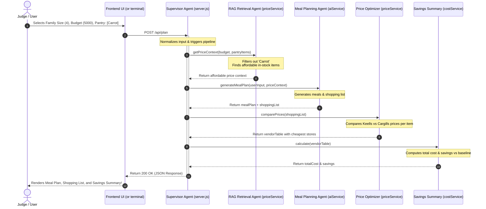

# Demo Flow - GrocerMind AI

This guide walks you through setting up and running the live demo for GrocerMind AI. It shows how the system responds to different user budgets, pantry contents, and dietary parameters to prove the MVP agentic pipeline functions correctly.

---

## 1. Setup & Installation

Before running the demo, ensure you have [Node.js](https://nodejs.org/) installed, then follow these steps in your terminal:

```bash
# 1. Navigate to the backend directory
cd backend

# 2. Start the Express server
node server.js
```

You should see the message: `Backend running on port 3000`.

---

## 2. Test Scenarios (Demo Script)

Below are three demo scenarios you can run using standard command-line tools to show the supervisor pipeline in action.

### Scenario A: Low Budget Constraint (LKR 1,000)
**Goal**: Verify that when a user inputs a very tight budget, the system filters out expensive proteins and selects only the cheapest staple flour and basic vegetables to stay within limits.

- **PowerShell (Windows)**:
  ```powershell
  Invoke-RestMethod -Uri "http://localhost:3000/api/plan" -Method Post -ContentType "application/json" -Body '{"familySize": 2, "budget": 1000, "dietaryPreference": "vegetarian", "pantryItems": [], "location": "Colombo"}' | ConvertTo-Json -Depth 5
  ```

- **Bash / macOS / Linux**:
  ```bash
  curl -X POST http://localhost:3000/api/plan \
       -H "Content-Type: application/json" \
       -d '{"familySize": 2, "budget": 1000, "dietaryPreference": "vegetarian", "pantryItems": [], "location": "Colombo"}'
  ```

- **Expected Outcome**:
  - The `priceContext.affordableItemCount` will be low.
  - The generated meal plan will consist of cheap vegetables and flour.
  - The total cost will remain under the budget.

---

### Scenario B: Pantry Item Exclusion (Pantry includes "Carrot")
**Goal**: Verify that ingredients already in the user's pantry are filtered out by the RAG Retrieval Agent and omitted from the generated meal plan or shopping list (avoiding unnecessary costs).

- **PowerShell (Windows)**:
  ```powershell
  Invoke-RestMethod -Uri "http://localhost:3000/api/plan" -Method Post -ContentType "application/json" -Body '{"familySize": 4, "budget": 5000, "dietaryPreference": "non-veg", "pantryItems": ["Carrot"], "location": "Colombo"}' | ConvertTo-Json -Depth 5
  ```

- **Bash / macOS / Linux**:
  ```bash
  curl -X POST http://localhost:3000/api/plan \
       -H "Content-Type: application/json" \
       -d '{"familySize": 4, "budget": 5000, "dietaryPreference": "non-veg", "pantryItems": ["Carrot"], "location": "Colombo"}'
  ```

- **Expected Outcome**:
  - The RAG agent filters out "Carrot".
  - The shopping list and vendor table will NOT contain "Carrot".

---

### Scenario C: High Budget Constraint (LKR 10,000)
**Goal**: Verify that with a higher budget, the system opens up access to premium ingredients, allowing proteins like Maldive Fish to be retrieved and integrated into meals.

- **PowerShell (Windows)**:
  ```powershell
  Invoke-RestMethod -Uri "http://localhost:3000/api/plan" -Method Post -ContentType "application/json" -Body '{"familySize": 4, "budget": 10000, "dietaryPreference": "non-veg", "pantryItems": [], "location": "Colombo"}' | ConvertTo-Json -Depth 5
  ```

- **Bash / macOS / Linux**:
  ```bash
  curl -X POST http://localhost:3000/api/plan \
       -H "Content-Type: application/json" \
       -d '{"familySize": 4, "budget": 10000, "dietaryPreference": "non-veg", "pantryItems": [], "location": "Colombo"}'
  ```

- **Expected Outcome**:
  - The `priceContext.affordableItemCount` will include proteins like "My Choice Maldive Fish Chips".
  - The meal plan incorporates proteins (e.g. Tuesday: Maldive Fish).

---

## 3. Demo Sequence Diagram

This sequence diagram illustrates how a successful request traverses the server during a demo presentation:


