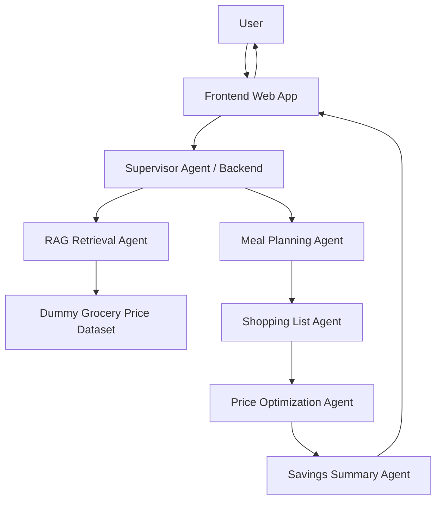
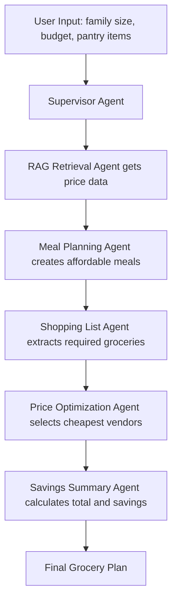
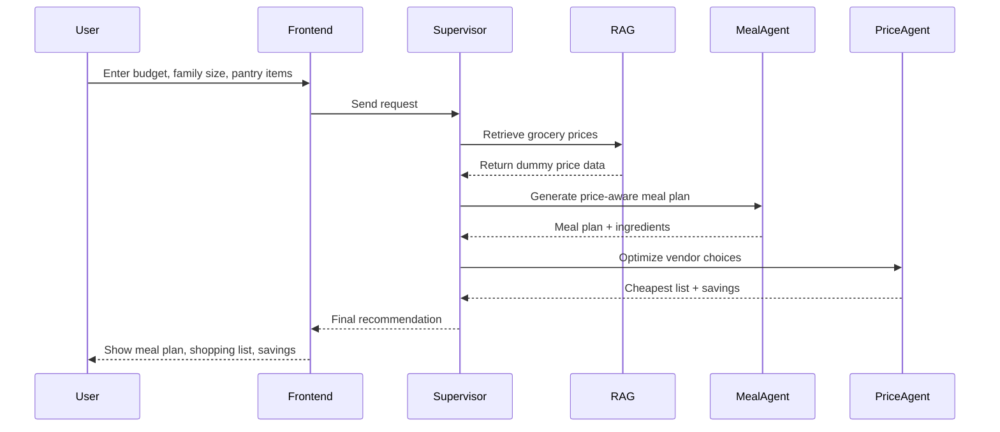

# GrocerMind AI Architecture

GrocerMind AI uses a supervisor-based agentic pipeline where dummy grocery price data is retrieved first, then used to generate a price-aware meal plan, shopping list, optimized vendor selection, and savings summary.

---

## Frozen Workflow

Supervisor Agent -> RAG Retrieval Agent -> Meal Planning Agent -> Shopping List Agent -> Price Optimization Agent -> Savings Summary Agent

---

## High-Level System Architecture

---

## Agentic Workflow

---

## Execution Sequence

---

## Technical Component Directory

To help the team navigate the repository during the hackathon, here is how the architectural diagram maps to the actual codebase files:

### 1. Frontend (`/frontend`)
- Currently placeholder/empty directory. Will house the user interface for inputting family details and viewing the generated meal plan and savings.

### 2. Express Backend Server (`/backend`)
- [server.js](file:///c:/Users/ASUS/Desktop/AGENTRIX26-TEAM35-Bug_Busters/backend/server.js): Entry point of the Express API, listening on port 3000.
- [api/plan.js](file:///c:/Users/ASUS/Desktop/AGENTRIX26-TEAM35-Bug_Busters/backend/api/plan.js): Maps the request to the Supervisor Agent pipeline execution.

### 3. Agent & Service Layer (`/backend/services`)
- [priceService.js](file:///c:/Users/ASUS/Desktop/AGENTRIX26-TEAM35-Bug_Busters/backend/services/priceService.js): 
  - Simulates the **RAG Retrieval Agent** by loading and parsing local store datasets.
  - Simulates the **Price Optimization Agent** by finding the cheapest stores and prices for the final shopping list.
- [aiService.js](file:///c:/Users/ASUS/Desktop/AGENTRIX26-TEAM35-Bug_Busters/backend/services/aiService.js): Simulates the **Meal Planning Agent** and **Shopping List Agent** by filtering affordable ingredients and proposing the meal plan and shopping list.
- [costService.js](file:///c:/Users/ASUS/Desktop/AGENTRIX26-TEAM35-Bug_Busters/backend/services/costService.js): Simulates the **Savings Summary Agent** by computing total checkout costs and savings compared to a Keells baseline.

### 4. Data Layer (`/`)
- [chroma_ready.json](file:///c:/Users/ASUS/Desktop/AGENTRIX26-TEAM35-Bug_Busters/chroma_ready.json): The primary vector-like text database representing store inventories, items, pricing, sizes, and categories.
