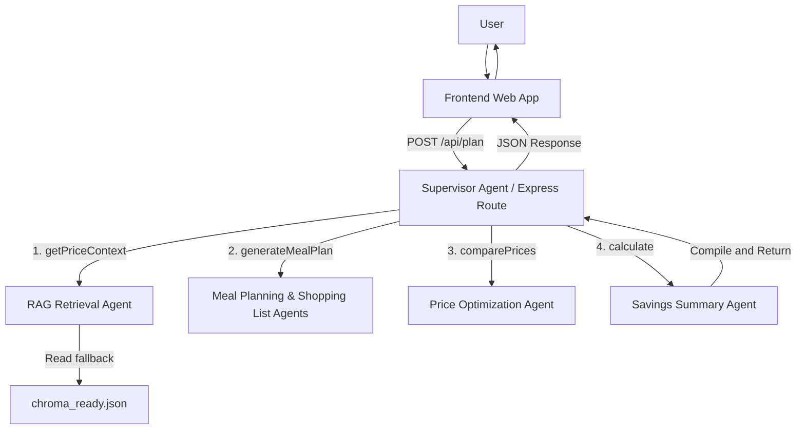

# GrocerMind AI Architecture

GrocerMind AI uses a supervisor-based agentic pipeline where dummy grocery price data is retrieved first, then used to generate a price-aware meal plan, shopping list, optimized vendor selection, and savings summary.

---

## Frozen Workflow

The agentic pipeline runs synchronously as a series of helper functions called in a single HTTP request cycle:

Supervisor Agent (api/plan.js) 
→ RAG Retrieval Agent (priceService.js) 
→ Meal Planning & Shopping List Agents (aiService.js) 
→ Price Optimization Agent (priceService.js) 
→ Savings Summary Agent (costService.js)

---

## High-Level System Architecture

---

## Technical Component Directory

To help the team navigate the repository, here is how the architectural elements map to the actual codebase files:

### 1. Frontend (`/frontend`)
- **Status**: Currently placeholder/empty directory. Will house the user interface for inputting family details and viewing the generated meal plan and savings.

### 2. Express Backend Server (`/backend`)
- [server.js](file:///c:/Users/ASUS/Desktop/AGENTRIX26-TEAM35-Bug_Busters/backend/server.js): Entry point of the Express API, running on port 3000. It uses CORS and body-parser middleware, routing `/api` requests to `/api/plan`.
- [api/plan.js](file:///c:/Users/ASUS/Desktop/AGENTRIX26-TEAM35-Bug_Busters/backend/api/plan.js): Maps POST requests to `/plan` and orchestrates the synchronous agent pipeline.

### 3. Agent & Service Layer (`/backend/services`)
- [priceService.js](file:///c:/Users/ASUS/Desktop/AGENTRIX26-TEAM35-Bug_Busters/backend/services/priceService.js): 
  - Simulates the **RAG Retrieval Agent** by loading and parsing local store datasets.
  - Simulates the **Price Optimization Agent** by comparing item prices in the shopping list across stores (Cargills, Keells) and returning a recommended store and price.
- [aiService.js](file:///c:/Users/ASUS/Desktop/AGENTRIX26-TEAM35-Bug_Busters/backend/services/aiService.js): Simulates the **Meal Planning Agent** and **Shopping List Agent** by filtering affordable ingredients and proposing a 2-day meal plan and required shopping list quantities.
- [costService.js](file:///c:/Users/ASUS/Desktop/AGENTRIX26-TEAM35-Bug_Busters/backend/services/costService.js): Simulates the **Savings Summary Agent** by computing total checkout costs and savings compared to a Keells baseline.

### 4. Data Layer (`/` & `/backend/data`)
- [chroma_ready.json](file:///c:/Users/ASUS/Desktop/AGENTRIX26-TEAM35-Bug_Busters/chroma_ready.json): The primary vector-like text database representing store inventories, items, pricing, sizes, and categories.
- [cargills.json](file:///c:/Users/ASUS/Desktop/AGENTRIX26-TEAM35-Bug_Busters/backend/data/cargills.json) and [keells.json](file:///c:/Users/ASUS/Desktop/AGENTRIX26-TEAM35-Bug_Busters/backend/data/keells.json): Secondary local JSON stores. Currently initialized as empty arrays (`{"items": []}`), which automatically triggers the price service to fall back to using `chroma_ready.json`.

---

## Architectural Risks & Key Assumptions
- **Stateless/Synchronous execution**: No persistent database or session states are managed. Each request executes a fresh calculation.
- **Budget Threshold**: Individual item affordability is defined as `price <= max(budget * 0.25, 250 LKR)`. 
- **Savings Baseline**: Savings are calculated relative to a "Keells baseline" (`item.prices.Keells || item.recommendedPrice || 0`). If an item is not sold at Keells, savings default to `0` LKR.
