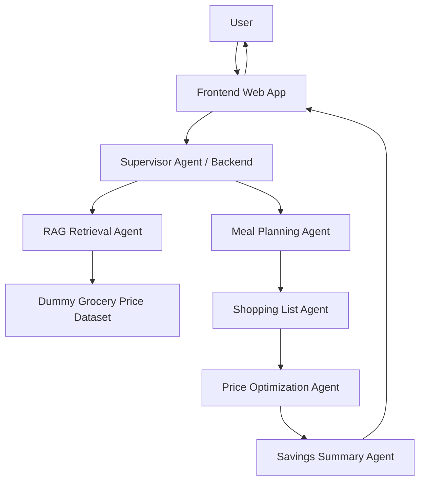
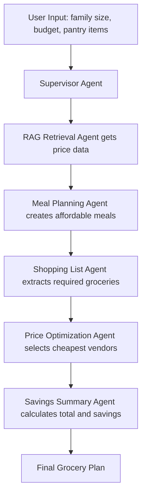
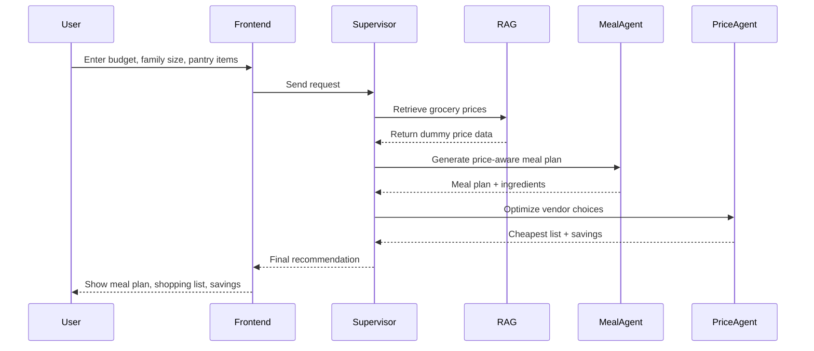

# GrocerMind AI Architecture

GrocerMind AI uses a supervisor-based agentic pipeline where dummy grocery price data is retrieved first, then used to generate a price-aware meal plan, shopping list, optimized vendor selection, and savings summary.

## Frozen Workflow

Supervisor Agent -> RAG Retrieval Agent -> Meal Planning Agent -> Shopping List Agent -> Price Optimization Agent -> Savings Summary Agent

## High-Level System Architecture

## Agentic Workflow

## Execution Sequence

